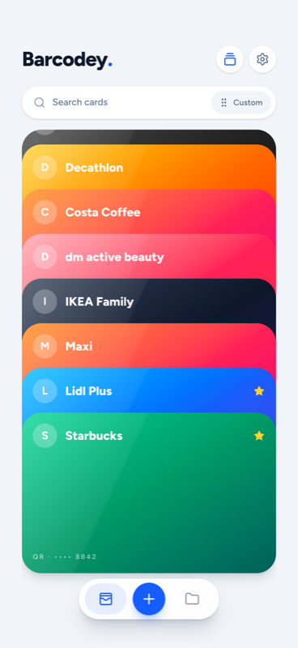
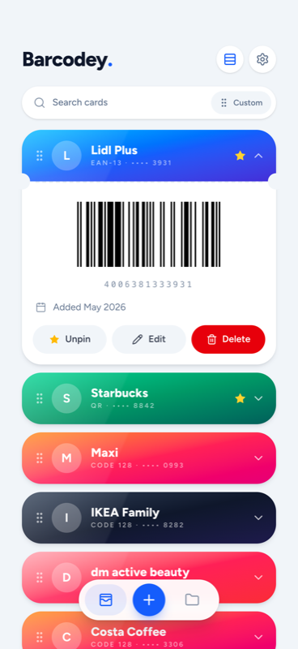
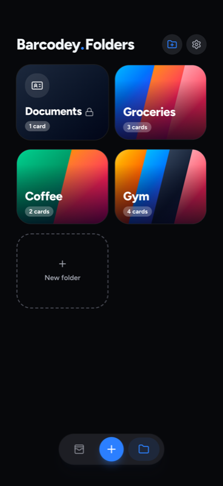
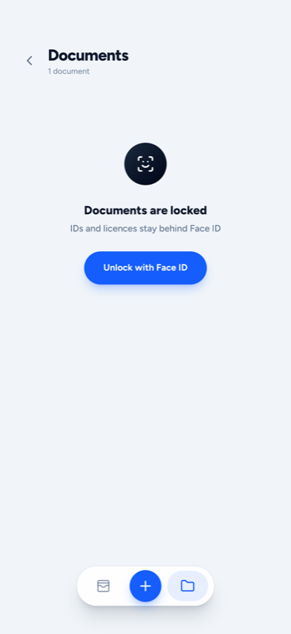

# Barcodey — Loyalty Card Wallet

A fast, private wallet for loyalty cards, membership cards, gift cards, and documents. Scan a card once, show it at the register, and the barcode is on screen at full brightness. Everything stays on your phone — no account, no cloud, no ads, no tracking.

[](LICENSE)


<p align="center">
  
  
  
  
</p>

## Download

- **iPhone** — [App Store](https://apps.apple.com/app/barcodey-loyalty-card-wallet/id6808041707)
- **Android** — Google Play and GitHub Releases APK (coming next)

## Why Barcodey

- **Scan and go** — point the camera at any card and it's saved in seconds. EAN, UPC, Code 128, Code 39, ITF, QR, Aztec, Data Matrix, PDF417, and more. Scan from a photo or type the number by hand.
- **Built for the checkout moment** — a card unfolds in place with the barcode on a white panel at maximum brightness. Hand-over mode locks the screen so you can pass the phone to the cashier.
- **Looks like a wallet** — brand logos and colors from a bundled catalog of 2,400+ brands, custom colors, cover photos, or a color pulled from the card's own photo. Swipeable deck, list, and grid views.
- **Folders and favorites** — group cards for groceries, gym, travel, or family. Favorites pin to the top; drag to reorder.
- **Documents** — IDs, licences, and membership documents with front/back photos in a folder locked behind Face ID / fingerprint.
- **Expiry reminders** — add an expiry date to any card or document and get a local notification 30, 7, and 1 day before.
- **Move to a new phone without a cloud** — the old phone plays an animated QR sequence, the new phone scans it, and the whole wallet comes across. Nothing leaves the two screens.
- **Quick actions** — long-press the app icon to jump straight to your top cards.
- **Light and dark**, haptics, and no "premium" card limit.

## Privacy

Barcodey has no server and no account. Cards, documents, and photos are stored only on your device; the app never uploads anything you store in it. Barcode scanning runs on-device. Backups are files you export and keep wherever you choose.

Full policy: https://fvitas.github.io/barcodey-privacy/

## Feedback

- [Suggest a brand](../../issues/new?template=suggest-brand.yml) for the catalog
- [Report a bug](../../issues/new?template=bug-report.yml)
- [Request a feature](../../issues/new?template=feature-request.yml)

## Development

Built with React, Vite, Tailwind, Motion, and Capacitor.

```sh
pnpm install
pnpm dev          # web dev server
pnpm test         # unit tests
pnpm build:brands # rebuild the bundled brand catalog
```

## Brand catalog data

The bundled brand catalog is generated from open data:

- Brand names, aliases, and locations from [name-suggestion-index](https://github.com/osmlab/name-suggestion-index) (BSD-3-Clause, © name-suggestion-index contributors)
- Brand metadata from [Wikidata](https://www.wikidata.org) (CC0)
- Logo images from [Wikimedia Commons](https://commons.wikimedia.org) (public domain or below the threshold of originality)

All logos and brand names are trademarks of their respective owners and are used solely to identify the corresponding loyalty programs.

## License

[GPL-3.0](LICENSE) © Filip Vitas
